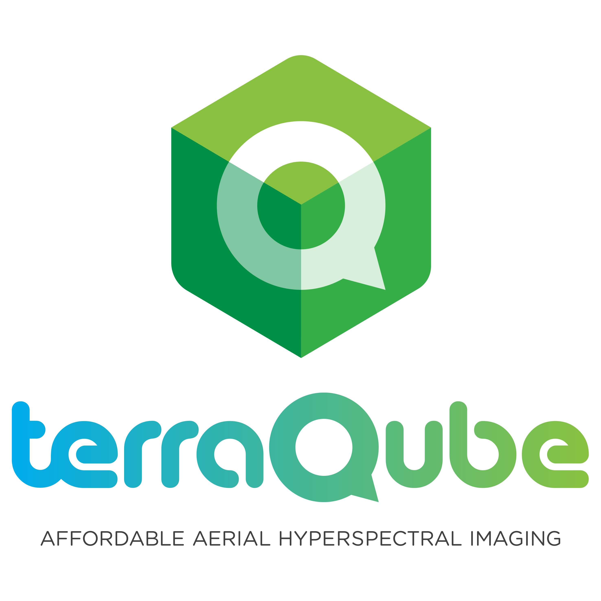
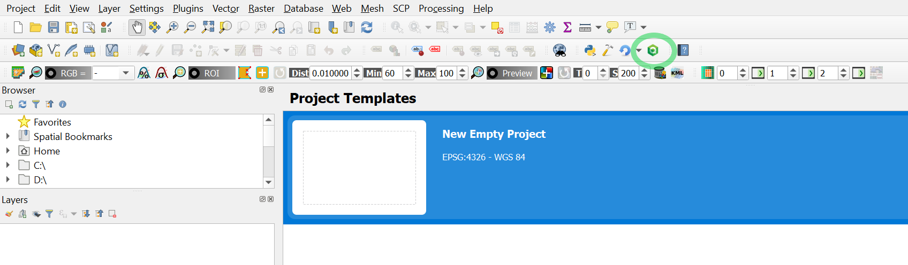

# Terraqube Cloud plugin v1.0.0
QGIS3 Plugin to access Terraqube's hyperspectral cloud.

Harness the power of the cloud to store and process huge hyperspectral images with Terraqube Cloud.

* Generate hyperspectral signatures and make transformations to huge hyperspectral images (cubes) without requiring expensive high performance workstations.
* Take benefit of the scale and power of the optimized server processing of Terraqube Cloud to do operations to hyperspectral images in seconds rather than in minutes or hours.
* Store and access huge amounts of data securely without worrying about losing it. Access your data from any device (laptop, desktop, tablet, smartphone, ...), any time.

## Getting started

This plugin has been tested with QGIS v3.12. You can install QGIS from [QGIS website](https://qgis.org/en/site/forusers/download.html).

Open QGIS, go to the *Plugins* menu and click on *Manage and Install Plugins*.

Search for "Terraqube Cloud" and click on *Install*.

Once installed, you can access Terraqube Cloud dialog from the plugins toolbar as shown below:

### Signing in

Before you can use the plugin you will have to create an account in Terraqube Cloud. You can sign up for free [here](http://www.terraqube.com/signup).

Once you have an account, login using your email/password. Keep the default server url.

### Projects

After logging in, the hiperqube tab will be automatically selected and the plugin will load all your projects. You can create new projects by clicking on the *Create project* task button next to the projects combo box.

After selecting a project, the plugin will show you all the hiperqubes that belong to that project.

### Hiperqubes

The table right below the projects combo box shows the list of hiperqubes that belong to that project with some basic information about them (dates, size, etc...). Note that the size is the compressed size.

You can upload new hiperqubes by clicking on the *Upload hiperqube* task button next to the hiperqube table. Note that this process can take a long time if your internet connection is slow. Anyway, an upload dialog will guide you through the upload process, showing you details of the upload progress.

Note that as of now only Gzipped BIL files in ENVI format are supported. You can get more details on this format [here](https://www.harrisgeospatial.com/docs/ENVIHeaderFiles.html).

You can single click a hiperqube in the table to load the hiperqube details from the server. Those details will show in the right hand *Hiperqube details* panel (i.e. lines, columns, bands, signatures, etc...).

You can double click a hiperqube in the table to show it in the map canvas. You can also do it by clicking on the *Show hiperqube* task button. Note that the raster that shows in the map canvas will be a single band raster (the chosen band will be the highest contrast band in the entire hiperqube). It will not have all the bands of the hiperqube, as this would take a very long time to download and process in QGIS (i.e. VNIR Hiperqubes captured with Terraqube's drones have more than 1200 bands). Regardless, all the bands are still stored in the cloud and will be used to calculate the signatures and perform any transformations.

### Signatures

Right below the hiperqube details frame there is a table that will show the list of hyperspectral signatures that have been created for this hiperqube. Each one of them will specify the coordinates of the pixel they refer to.

By checking the checkbox next to each signature, the signature chart will be downloaded and shown in the map canvas on top of the hiperqube rasterized.

A couple of considerations with regards to signatures:

* Signatures will be attached on top of the raster layer of the hiperqube. They will always show in the same dimensions regardless of the zoom in the canvas.
* Signatures will remain in Terraqube Cloud after being created, even if the raster layer is deleted.
* You can show/hide signatures by clicking on their checkbox in the signatures table.

### Transformations

Transformations are currently under development and are still not supported yet. 

### Errors

The plugin will output any errors connecting to the Terraqube Cloud in the Message Bar.

Please, do not hesitate to report any problems you encounter to our [support email address](mailto:support@terraqube.com).

## Terraqube Services

Terraqube offers two different types of services:

* Hyperspectral image capturing from drones (Terraqube Fly).
* Hyperspectral image processing in the cloud (Terraqube Cloud).

If you would like to know more about our services please visit our website:

[http://www.terraqube.com](http://www.terraqube.com)

## License

This product is licensed under [GNU General Public License](LICENSE).

## About

This plugin has been developed by Arnau Panosa and is intellectual property of Terraqube S.L.

The plugin uses fontawesome free tier icons.
